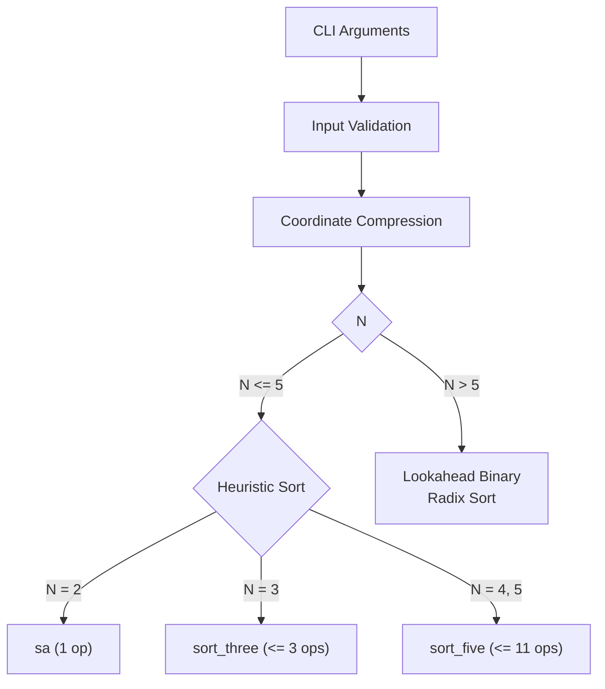

*This project has been created as part of the 42 curriculum by aalemami.*

# Push_swap
*Because Swap_push doesn't feel as natural*

---

## Description

Push_swap is a sorting project from the 42 curriculum. The task is to sort a random sequence of integers using two stacks (`a` and `b`) and a fixed set of stack operations, producing the shortest possible list of instructions.

Stack `a` begins with a random set of unique integers (positive and/or negative), and stack `b` starts empty. The program must output a sequence of instructions that leaves `a` sorted in ascending order with the smallest number at the top, and `b` empty.

This implementation sorts the input by:
1. **Coordinate Compression (Rank Indexing)**: Replacing raw values with 0-based ranks ($0$ to $N - 1$), which eliminates sign handling and reduces the number of binary digits the algorithm needs to process.
2. **Heuristic Solvers ($N \le 5$)**: Hard-coded decision trees for small inputs that guarantee minimal operation counts.
3. **Lookahead Binary Radix Sort ($N > 5$)**: A modified binary radix sort where, instead of blindly flushing Stack B back to Stack A after each bit pass, the algorithm inspects the next bit of each element while it is still in Stack B. Elements that belong in Stack B for the next pass stay there (`rb`), avoiding redundant `pa` followed by `pb` sequences.

---

---

## Sorting Pipeline



---

### Input Validation
*File: `input_validation.c`*

All arguments are validated before any sorting takes place:
- Each token must consist of valid digits with an optional leading `+` or `-`.
- Every value must fit within the signed 32-bit integer range (`-2147483648` to `2147483647`).
- No duplicates are allowed.
- Total element count must not exceed 1024.

If any check fails, the program writes `Error\n` to standard error and exits.

---

### Coordinate Compression
*File: `indexing.c`*

Applying binary radix sort directly to raw signed 32-bit integers would require up to 32 bit passes and special handling for negative values.

Coordinate compression replaces each value with its rank among the sorted input:
1. Copy all elements from Stack A into a temporary array.
2. Sort the array.
3. Replace each element in Stack A with its position (rank) in the sorted array.

#### Example

| Step | Values |
| :--- | :--- |
| **Raw Input** | `[ 42, -15, 100, 0, 7 ]` |
| **Sorted** | `[ -15, 0, 7, 42, 100 ]` |
| **Ranks** | `-15 -> 0, 0 -> 1, 7 -> 2, 42 -> 3, 100 -> 4` |
| **Indexed Stack** | `[ 3, 0, 4, 1, 2 ]` |

After indexing, ranks range from $0$ to $N - 1$. For 100 elements the highest rank is 99, which needs 7 bits. For 500 elements the highest rank is 499, which needs 9 bits. This directly determines the number of bit passes the radix sort executes.

---

### Small Size Strategy ($N \le 5$)
*File: `small_sort.c`*

For small inputs, radix sort is not worth the overhead. Dedicated solvers handle these cases:

- **$N = 2$**: A single `sa` if the two elements are out of order.
- **$N = 3$ (`sort_three`)**: Finds the position of the largest element and resolves the ordering. Worst case: 3 operations.
- **$N = 4$ or $5$ (`sort_five`)**:
  1. Finds rank `0` (the smallest) and rotates it to the top using the shortest path (`ra` or `rra`).
  2. Pushes it to Stack B (`pb`).
  3. Finds rank `1`, moves it to top, pushes to Stack B (`pb`).
  4. Sorts the remaining 3 elements with `sort_three`.
  5. Pushes both elements back (`pa`, `pa`).
  6. Worst case: 11 operations (verified across all 120 permutations of 5 elements).

---

### Lookahead Binary Radix Sort ($N > 5$)
*File: `radix_sort.c`*

#### How Standard Binary Radix Sort Works on Two Stacks
For each bit position $k$:
1. Scan Stack A. If bit $k$ of the top element is `0`, push it to Stack B (`pb`). If it is `1`, rotate it in Stack A (`ra`).
2. After processing all elements, push everything from Stack B back to Stack A (`pa` until B is empty).

The problem: in the next pass ($k + 1$), roughly half the elements just returned to A will have bit $k + 1 = 0$ and be immediately pushed right back to B.

#### The Lookahead Modification
Instead of dumping all of Stack B back to Stack A after pass $k$, the algorithm checks bit $k + 1$ of each element while it is still in Stack B:

```c
static void	part2(t_stack *a, t_stack *b, int bit, int max_number_digits)
{
	int	size;
	int	i;

	size = b->top;
	i = 0;
	if (bit < max_number_digits - 1)
	{
		while (i <= size)
		{
			if (((b->items[b->top] >> (bit + 1)) & 1) == 0)
				rotate(b, "rb\n");       /* Keep in B for next pass */
			else
				push_pop(a, b, "pa\n");  /* Send to A */
			i++;
		}
	}
	else
		while (!is_empty(b))
			push_pop(a, b, "pa\n");      /* Last pass: flush all to A */
}
```

- **Next bit is 0**: The element will need to be in Stack B during the next pass anyway. It stays in B (`rb`).
- **Next bit is 1**: The element belongs in A for the next pass. It gets transferred (`pa`).
- **Early exit**: Before each pass, `is_sorted(a) && is_empty(b)` is checked to terminate early if the stack is already sorted.

This eliminates the redundant `pa`-then-`pb` cycle that standard radix sort produces.

---

## Stack Implementation

The stacks use static arrays rather than linked lists (`stack.h`):

```c
#define MAX 1024

typedef struct s
{
    int items[MAX];
    int top;
}   t_stack;
```

The 42 project tests up to 500 elements. A fixed-size array of 1024 keeps the implementation straightforward: no node allocation, no pointer bookkeeping, no `free` chains. `items[0]` is the bottom of the stack, `items[top]` is the top.

---

## Measured Results

Operation counts are deterministic for a given input size because the radix sort processes a fixed number of bit passes based on the rank range, not the specific arrangement of elements.

| Input Size | Operations Produced | 42 Target (100% Score) |
| :--- | :--- | :--- |
| **2** | 1 (worst case) | - |
| **3** | 3 (worst case) | $\le 3$ |
| **5** | 11 (worst case, all 120 permutations tested) | $\le 12$ |
| **100** | 913 | $< 700$ |
| **500** | 5,765 | $< 5,500$ |

Measured across additional sizes for reference:

| N | Operations |
| :--- | :--- |
| 6 | 25 |
| 10 | 54 |
| 25 | 166 |
| 50 | 394 |
| 200 | 2,076 |
| 300 | 3,501 |
| 400 | 4,652 |

---

## Available Operations

| Instruction | Description |
| :--- | :--- |
| `sa` | Swap the first 2 elements at the top of stack `a`. |
| `sb` | Swap the first 2 elements at the top of stack `b`. |
| `ss` | `sa` and `sb` at the same time. |
| `pa` | Take the first element at the top of `b` and put it at the top of `a`. |
| `pb` | Take the first element at the top of `a` and put it at the top of `b`. |
| `ra` | Shift up all elements of stack `a` by 1. The first element becomes the last. |
| `rb` | Shift up all elements of stack `b` by 1. The first element becomes the last. |
| `rr` | `ra` and `rb` at the same time. |
| `rra` | Shift down all elements of stack `a` by 1. The last element becomes the first. |
| `rrb` | Shift down all elements of stack `b` by 1. The last element becomes the first. |
| `rrr` | `rra` and `rrb` at the same time. |

---

## Instructions

### Compilation

```bash
make
```

Compiles `libft` and builds the `push_swap` executable with `-Wall -Wextra -Werror`.

```bash
make clean    # Remove object files
make fclean   # Remove object files and executable
make re       # Full rebuild
```

### Execution

```bash
./push_swap 2 1 3 6 5 8
```

Arguments can be passed as separate values or within quotes:

```bash
./push_swap "2 1 3 6 5 8"
./push_swap 42 -17 88 0 105 3 24 9
```

Count operations:

```bash
./push_swap 2 1 3 6 5 8 | wc -l
```

Verify correctness with the 42 checker:

```bash
ARG="4 67 3 87 23"; ./push_swap $ARG | ./checker_OS $ARG
```

No arguments produces no output. Invalid input (non-integers, duplicates, overflow) prints `Error\n` to stderr.

---

## Resources

1. [Radix Sort Visual Explanation](https://youtube.com/shorts/ZHjCj0Oz6hk?si=5SpLmqBpUOKFckCH)
2. [Coordinate Compression / Indexing](https://youtu.be/Jemuod4wKWo?si=iCpkjPlPGj02fo42)
3. 42 Push_swap Subject (Version 10.1)

### AI Usage
- **Visualizer**: The web visualizer (`index.html`) was developed with AI assistance for the interface layout and interactive playback controls.
- **Documentation**: AI was used to help structure and format this README.