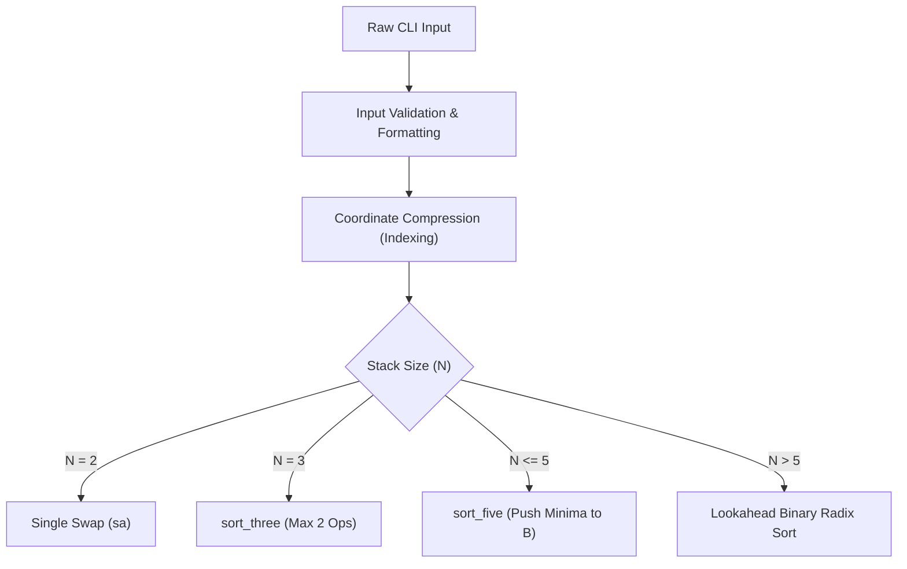

*This project has been created as part of the 42 curriculum by aalemami*

# Push_swap
*Because Swap_push doesn’t feel as natural*

<p align="center">
  <a href="https://ali-alemami.github.io/push_swap/">
    
  </a>
  
  
</p>

> 🚀 **[Click here to open the Live Interactive Push_Swap Visualizer](https://ali-alemami.github.io/push_swap/)** directly in your browser — test custom inputs, control playback speed, and see the lookahead optimization in action!

---

## 📌 Description
The goal of **Push_swap** is to sort a stack of 32-bit signed integers using only two stacks (**Stack A** and **Stack B**) and a restricted set of stack manipulation instructions, producing the sorted output with a minimal operation count (smallest number at the top of Stack A).

This implementation utilizes a **Rank-Indexed Binary Radix Sort** combined with a **Next-Bit Lookahead Optimization**, eliminating redundant push/pop transfers between stacks.

Included custom libraries:
- `libft` (Custom C Standard Library)
- `ft_printf` (Custom formatted output implementation)

---

## 🎮 Interactive Visualizer (Live in Browser)

You can launch the visualizer in 1 click at **[ali-alemami.github.io/push_swap](https://ali-alemami.github.io/push_swap/)**.

### What the Visualizer Shows:
* **Real-time Dual Stacks**: Watch Stack A and Stack B update with each instruction.
* **Bitwise Representation**: Every number displays its binary value (e.g. `#3` $\rightarrow$ `0011`).
* **Active Bit Highlights**: Clearly highlights the current bit being evaluated.
* **Lookahead Callouts**: Explains the exact condition when an element stays in Stack B (`rb`) instead of being pushed back (`pa`).
* **Controls**: Forward / backward single-stepping, autoplay with speed slider, custom input box, and random array generator.

```
       Stack A (Top)       ───▶  [ #0 | 0000 ]   (Smallest)
                                 [ #1 | 0001 ]
                                 [ #2 | 0010 ]
       Stack A (Bottom)    ───▶  [ #3 | 0011 ]   (Largest)
```

---

## 🏗️ Architecture & Stack Data Structure

Unlike traditional linked-list implementations, this project uses fixed-capacity, cache-friendly array-backed stacks defined in `stack.h`:

```c
#define MAX 1024

typedef struct s
{
    int items[MAX];
    int top;
} t_stack;
```

### Stack Orientation & Memory Layout
* **`items[0]`**: Represents the **bottom** of the stack.
* **`items[top]`**: Represents the **top** of the stack.
* **Sorted Criterion**: When Stack A is sorted in ascending order (top-to-bottom), `items[top]` holds the smallest integer and `items[0]` holds the largest.

---

## ⚡ Sorting Pipeline & Algorithmic Breakdown



---

### Phase 1: Coordinate Compression (Indexing)
*File: `indexing.c`*

Radix Sort on raw signed 32-bit integers requires handling negative sign bits and up to 32 bit-passes ($O(32 \times 2N)$ operations). 

**The Indexing Solution**:
1. Copy all items from Stack A to a temporary array.
2. Sort the array using Bubble Sort.
3. Replace each value in Stack A with its sorted **0-based rank** ($0$ to $N - 1$).

#### Example:
| Raw Input | `[ 42, -15, 100, 0, 7 ]` |
| :--- | :--- |
| **Sorted Order** | `[ -15, 0, 7, 42, 100 ]` |
| **Assigned Ranks** | `-15 ➔ 0`, `0 ➔ 1`, `7 ➔ 2`, `42 ➔ 3`, `100 ➔ 4` |
| **Indexed Stack** | `[ 3, 0, 4, 1, 2 ]` |

**Benefit**: The maximum value in Stack A is strictly $N - 1$. The required number of bit passes is reduced to:
$$\text{Max Bits} = \lfloor \log_2(N - 1) \rfloor + 1$$
* For 100 elements: strictly $\leq 7$ bit passes.
* For 500 elements: strictly $\leq 9$ bit passes.

---

### Phase 2: Small Size Strategy ($N \leq 5$)
*File: `small_sort.c`*

For small datasets, dedicated heuristic solvers are used instead of Radix Sort:
* **$N = 2$**: Swaps top elements if unsorted (`sa`).
* **$N = 3$ (`sort_three`)**: Identifies the position of the maximum element and reaches sorted order within 1 or 2 operations (`sa`, `ra`, `rra`).
* **$N \le 5$ (`sort_five`)**:
  1. Locates rank `0` (the minimum) and calculates the shortest path (`ra` vs `rra`) using `move_index_to_top`.
  2. Pushes `0` to Stack B (`pb`).
  3. Locates rank `1`, moves it to top, and pushes to Stack B (`pb`).
  4. Runs `sort_three` on the remaining 3 elements in Stack A.
  5. Pushes `1` and `0` back to Stack A (`pa`, `pa`).

---

### Phase 3: Large Sort & 🚀 Lookahead Radix Sort
*File: `radix_sort.c`*

#### ❌ The Standard Radix Flaw:
In standard binary radix implementations:
1. For bit `k`, items with bit $k = 0$ are pushed to B (`pb`), items with bit $k = 1$ are rotated in A (`ra`).
2. At the end of the pass, **all items in B are pushed back to A blindly** (`while (!empty(b)) pa;`).
3. **The Inefficiency**: In the very next pass for bit $k + 1$, roughly half of those returned elements will have bit $k + 1 = 0$ and will be **immediately pushed right back into Stack B**!

#### ⚡ The Lookahead Optimization (`part2` in `radix_sort.c`):
Instead of dumping Stack B back into Stack A, `part2` inspects the **NEXT bit ($bit + 1$)** of each element while it is still in Stack B:

```c
static void	part2(t_stack *a, t_stack *b, int bit, int max_number_digits)
{
	int	size;
	int	i;

	size = b->top;
	i = 0;
	if (bit < max_number_digits - 1)
	{
		while (i <= size)
		{
			// Lookahead at next bit (bit + 1)
			if (((b->items[b->top] >> (bit + 1)) & 1) == 0)
				rotate(b, "rb\n");       // RETAIN in Stack B!
			else
				push_pop(a, b, "pa\n");  // Send to Stack A
			i++;
		}
	}
	else
		while (!is_empty(b))
			push_pop(a, b, "pa\n");      // Final pass: flush all to A
}
```

#### How it optimizes operation count:
* **Bit $k+1 = 0$**: The element already belongs in Stack B for the next iteration. It rotates inside Stack B (`rb`) and stays there!
* **Bit $k+1 = 1$**: The element belongs in Stack A for the next iteration, so it is pushed back (`pa`).
* **Early Exit**: `is_sorted(a) && is_empty(b)` is checked at the start of every cycle to terminate as soon as the sequence reaches order.

---

## 📊 Performance & Optimization Comparison

| Feature | Standard Binary Radix | Lookahead Optimized Radix (aalemami) |
| :--- | :--- | :--- |
| **Bit Range** | 32 passes (Raw 32-bit signed ints) | $\lceil \log_2(N) \rceil$ passes (Rank Indexed) |
| **B to A Restoration** | Blind flush via `pa` | **Lookahead Next-Bit Partitioning** (`rb` / `pa`) |
| **Wasted Transfers** | High (`pa` followed immediately by `pb`) | **Zero redundant inter-stack transfers** |
| **Early Termination** | None (runs all bit passes) | Verified before each bit pass |

---

## 🛠️ Available Operations

| Operation | Description |
| :--- | :--- |
| `sa` | **Swap A**: Swap the first 2 elements at the top of Stack A. |
| `sb` | **Swap B**: Swap the first 2 elements at the top of Stack B. |
| `ss` | `sa` and `sb` simultaneously. |
| `pa` | **Push A**: Take the top element of B and push it onto A. |
| `pb` | **Push B**: Take the top element of A and push it onto B. |
| `ra` | **Rotate A**: Shift up all elements of Stack A by 1 (top becomes bottom). |
| `rb` | **Rotate B**: Shift up all elements of Stack B by 1 (top becomes bottom). |
| `rr` | `ra` and `rb` simultaneously. |
| `rra` | **Reverse Rotate A**: Shift down all elements of Stack A by 1 (bottom becomes top). |
| `rrb` | **Reverse Rotate B**: Shift down all elements of Stack B by 1 (bottom becomes top). |
| `rrr` | `rra` and `rrb` simultaneously. |

---

## 🚀 Instructions

### Installation
```bash
git clone https://github.com/ali-alemami/push_swap.git
cd push_swap
```

### Compilation
Compile the project using the included `Makefile`:
```bash
make
```
This compiles `libft`, `ft_printf`, and builds the `push_swap` executable.

### How to Use
Run `push_swap` followed by a list of integers:
```bash
./push_swap 2 1 3 6 5 8
```

You can pass arguments as separate arguments, a single quoted string, or mixed:
```bash
./push_swap "1 2 3"
./push_swap 1 "2 3"
./push_swap 42 -17 88 0 105 3 24 9
```

---

## 📚 Resources
1. **Radix Sort Visually Explained**: [YouTube Shorts](https://youtube.com/shorts/ZHjCj0Oz6hk?si=5SpLmqBpUOKFckCH)
2. **What is Indexing?**: [Database & Array Indexing](https://youtu.be/Jemuod4wKWo?si=iCpkjPlPGj02fo42)

---

## 📄 License
This project is open-source and created as part of the 42 Network common core curriculum.